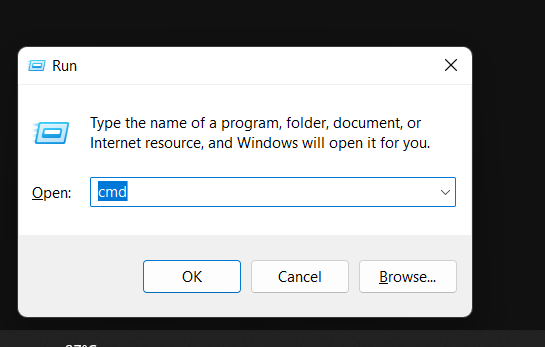
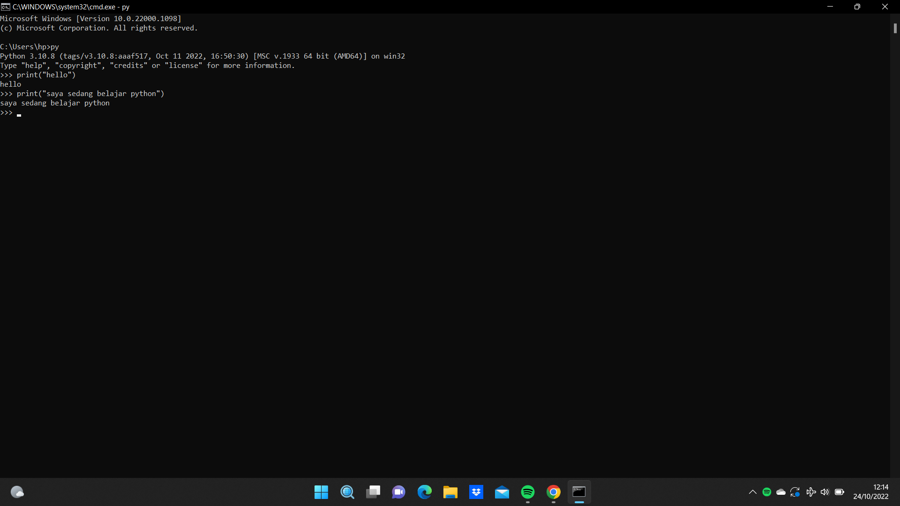
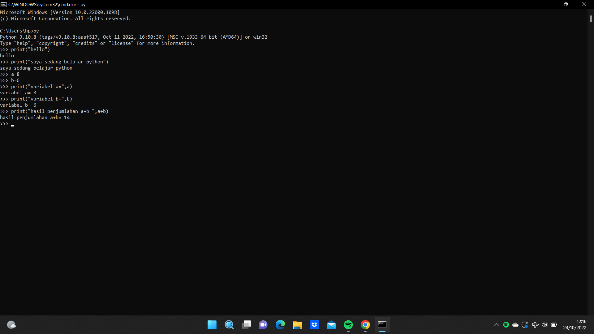
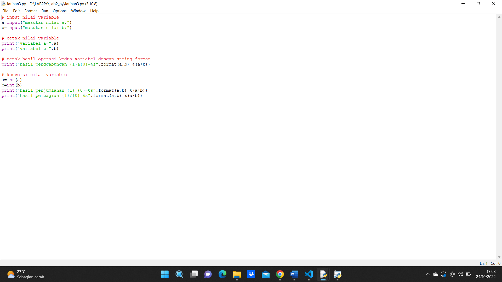
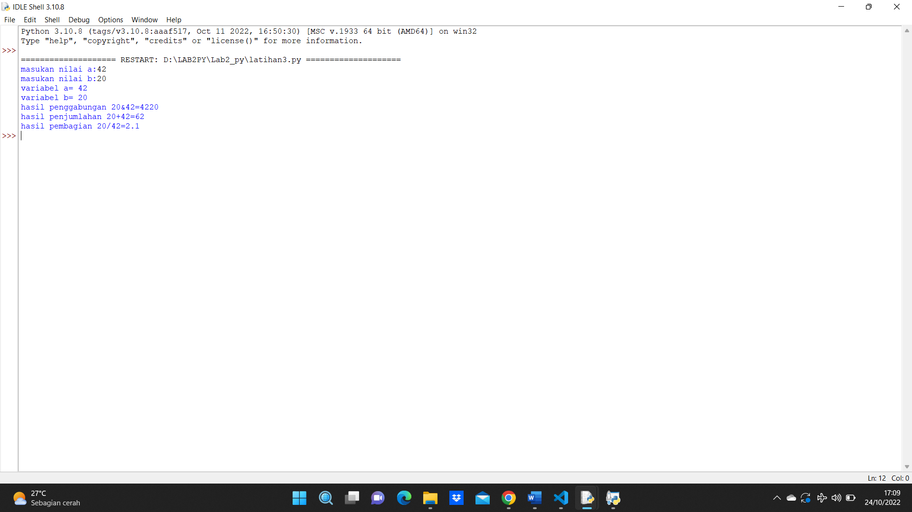

# Lab2_py

# MENJALANKAN PYTHON CONSOLE

1. Pastikan python sudah terinstal pada laptop

2. Buka CMD dengan cara klik windows + r lalu klik 'oke'

3. Menampilkan Latihan1 Python, "Hello" dan "Saya sedang belajar python"

4. Menampilkan Latihan2 Python. menjumlahkan dua buah bilangan menggunakan variabel a dan b

# MENJALANKAN IDLE

1. IDLE adalah teks editor bawaan python yang sudah otomatis terinstal saat kita menginstal python

2. Menjalankan IDLE 

- Membuat fungsi input untuk mengambil nilai variabel
- Mencetak hasil inputan
- Mencetak hasil inputan variabel dengan format string
- Konversi nilai variabel

- Hasil dari program

# MENGCOMMIT FILE YANG SUDAH DIKERJAKAN KEDALAM GITHUB

1. Langkah-langkahnya adalah sebagai berikut
